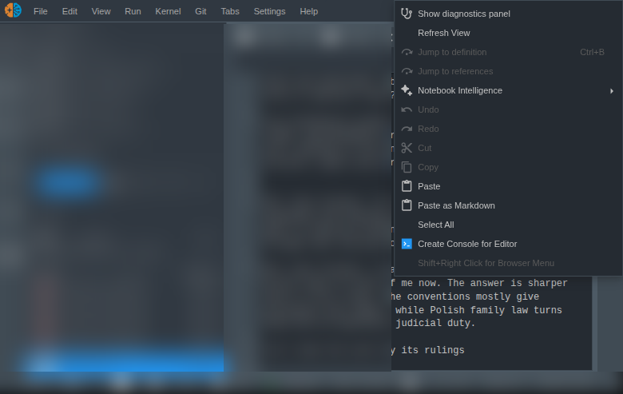

# jupyterlab_paste_content_as_markdown_extension

[](https://github.com/stellarshenson/jupyterlab_paste_content_as_markdown_extension/actions/workflows/build.yml)
[](https://www.npmjs.com/package/jupyterlab_paste_content_as_markdown_extension)
[](https://pypi.org/project/jupyterlab-paste-content-as-markdown-extension/)
[](https://pepy.tech/project/jupyterlab-paste-content-as-markdown-extension)
[](https://jupyterlab.readthedocs.io/en/stable/)
[](https://kolomolo.com)
[](https://www.paypal.com/donate/?hosted_button_id=B4KPBJDLLXTSA)

> [!TIP]
> This extension is part of the [stellars_jupyterlab_extensions](https://github.com/stellarshenson/stellars_jupyterlab_extensions) metapackage. Install all Stellars extensions at once: `pip install stellars_jupyterlab_extensions`

Paste clipboard content as markdown into JupyterLab. Copy formatted text from a web page, email, or Word document, right-click in a text editor or notebook cell, and select "Paste as Markdown" - the HTML formatting is converted to clean markdown on the fly.

**Full disclosure:** This extension adds one context menu item. It reads your clipboard, converts whatever formatting it finds to markdown, and pastes it. That's it. No AI, no blockchain, no cloud sync. Just clipboard-to-markdown, the way nature intended.



## Features

- **Paste as Markdown context menu** - Right-click in a text editor or a notebook cell's input area to find "Paste as Markdown" directly below the regular paste
- **HTML to markdown conversion** - Converts formatted HTML copied from web pages, emails, and documents into clean markdown using ATX headings, fenced code blocks, and standard list markers
- **Rich text support** - Handles content copied from Word, Google Docs, Confluence, Notion, and other rich text editors that place HTML on the clipboard
- **Preserves structure** - Maintains headings, lists, links, bold, italic, code blocks and tables during conversion, including tables copied from a spreadsheet, which carry no header row of their own. Markdown has no merged cell, so a `colspan` or `rowspan` keeps one column and its row is padded out. Every value survives, but cells beside or below a merged one can sit a column left of where the spreadsheet drew them
- **Discards what markdown cannot carry** - Stylesheets, scripts and document metadata are dropped rather than pasted as text, so a paste from Word does not arrive with its CSS attached
- **Replaces the selection** - Behaves like the built-in paste: selected text is replaced, not written alongside
- **Plain text fallback** - When the clipboard offers no HTML, or the HTML converts to nothing, the plain text content is pasted as-is

## How It Works

Most applications place both plain text and HTML on the clipboard when you copy formatted content. This extension reads the HTML flavour via the browser Clipboard API, runs it through [Turndown](https://github.com/mixmark-io/turndown) with the GFM table plugin, and replaces the current selection with the result. If no HTML is found, it falls back to plain text.

Images are kept when their source still resolves elsewhere - an `http(s):`, `data:` or protocol-relative URL. Word and Outlook reference images as `file:///` paths in a local temp folder, which resolve on no other machine, so those are dropped rather than pasted as links that cannot load.

A link wrapping block content - a heading, a list, a table, or simply a `div` - loses its address: markdown has nowhere to put one, and the content it wraps is worth more than the stray brackets that keeping it would produce.

Conversion reads HTML tags, not CSS. Formatting an application expresses only through a style attribute - Google Docs writes bold as `font-weight:700` rather than `<b>` - arrives as plain text.

Coverage is file editors and notebook cells. The console prompt, the terminal and the Settings raw editor are not covered.

## Requirements

- JupyterLab >= 4.0.0

> [!NOTE]
> The browser Clipboard API requires a secure context (HTTPS or localhost). If JupyterLab is served over plain HTTP on a remote host, the clipboard read will fail and you will see an error dialog. Use HTTPS or an SSH tunnel in that case.

## Install

```bash
pip install jupyterlab_paste_content_as_markdown_extension
```

## Usage

1. Copy formatted content from any source (web page, Word, Google Docs, email)
2. Right-click in a JupyterLab text editor, or in a notebook cell's input area
3. Select **Paste as Markdown** from the context menu

The converted markdown replaces the current selection, or is inserted at the cursor when nothing is selected.

## Uninstall

```bash
pip uninstall jupyterlab_paste_content_as_markdown_extension
```

## License

BSD 3-Clause License
